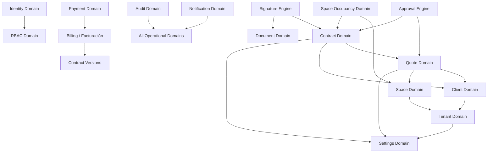

# Domain Dependency Graph

## Overview
This document maps the dependencies between domains, detecting hidden or circular dependencies.

## Dependency Matrix

## Critical Findings
1. **Facturación Isolation:** The strict rule that Billing must only read `contract_versions.snapshot_data` breaks standard relational design, enforcing an Event-Sourced or Snapshot-based architectural dependency. This prevents circular references but requires a robust Snapshot Engine.
2. **Space Occupancy vs Contract:** A direct foreign key creates a tight coupling. We must use domain events (`ContractSigned` -> `UpdateOccupancy`).
3. **Approval Engine:** Must not have hard foreign keys to `quotes` or `contracts`. It must use generic `entity_type` and `entity_id` to avoid bidirectional coupling.
