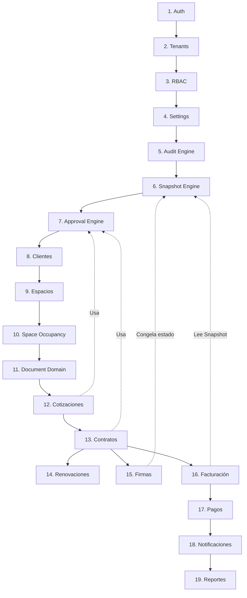

# DOMAIN DEPENDENCY GRAPH V2

## Análisis de Acoplamientos Peligrosos Evitados:
- Facturación y Clientes/Espacios están aislados por la barrera del *Snapshot Engine*.
- Ocupación y Contratos están separados; un contrato puede cancelarse sin liberar espacio de inmediato, o liberar espacio sin borrar el contrato.
- Pagos depende de Facturas, pero no procesa dinero, solo aprueba *Documents* subidos a través de *Approval Engine*.
