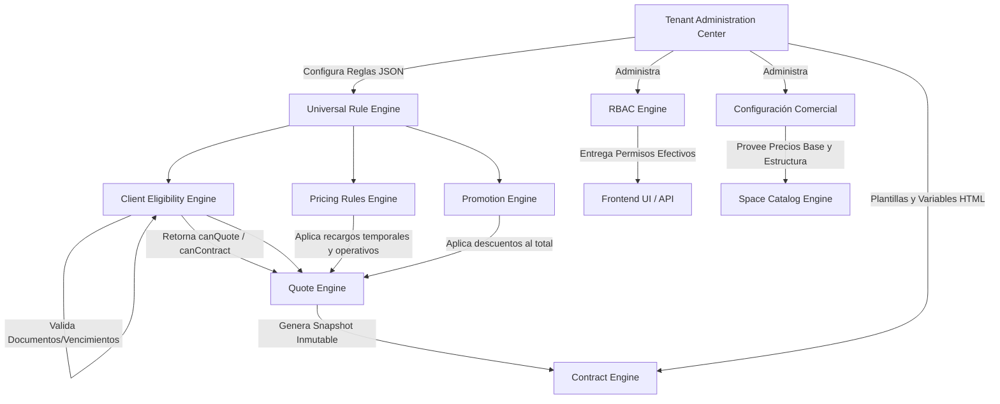

# MASTER DOMAIN MODEL (Arquitectura Cotizador 2.0 Enterprise)

## 1. Visión y Paradigma
Este documento es la Fuente Principal de Conocimiento del Sistema.
Cotizador 2.0 es una **Configuration-Driven Platform**. El código actúa únicamente como el conducto; el comportamiento, validación, matemática, legalidad y auditoría del negocio se administran a través del *Tenant Administration Center*. 

Toda autorización es **Permission-First**, operando estrictamente sobre Permisos Efectivos, sin considerar los nombres técnicos de los roles.

## 2. Inmutabilidad Total (Las 9 Estrategias de Snapshot)
Cotizador 2.0 Enterprise es estrictamente inmutable frente al tiempo. Toda transacción legal y financiera congela el mundo exterior en el milisegundo de su emisión.

La Estrategia de Snapshotting exige la recolección obligatoria de:
1. **client_snapshot**: Clon profundo del RFC, Razón Social, Contactos y Domicilio.
2. **tenant_snapshot**: Congela la entidad legal que cobra.
3. **branding_snapshot**: Logos, colores y membretes de la empresa en ese momento.
4. **template_snapshot**: El HTML crudo y cláusulas de la versión exacta de la plantilla utilizada.
5. **space_snapshot**: Clon profundo del salón, dimensiones, capacidad, fotos y precio base.
6. **pricing_snapshot**: Audit trail inmutable de las reglas de sobreprecio o ajuste base.
7. **tax_snapshot**: Impuestos aplicados (tasa e importe).
8. **promotion_snapshot**: Descuentos aplicados (versión de la regla y justificación).
9. **eligibility_snapshot**: El veredicto del por qué se aprobó o bloqueó al cliente.

Bajo este modelo: Todo histórico del sistema se reconstruirá desde el Snapshot, **JAMÁS** buscando los datos de catálogos vivos.

## 3. Motores Operativos Extendidos
Para garantizar el flujo de la vida real en los recintos comerciales, el sistema integra motores avanzados antes y después de la cotización:

- **Space Availability & Occupancy Engine**: Previene la doble reserva. Interpreta políticas de exclusividad (`exclusive`, `shared`, `segmented`), gestiona Reservas Suaves (`tentative`), e inyecta Bloqueos Operativos automáticos (`premontaje`, `desmontaje`) consumiendo las directivas del Universal Rule Engine.
- **CFDI & Hybrid Billing Engine**: Cierra el ciclo financiero anclado al `Contract File`. Soporta carga de facturas manuales (Validando RFC y XML/UUID contra los Snapshots) y define la interfaz `InvoiceProvider` para futuras integraciones directas (Ej. Intelisis). Abstrae el estado financiero del contrato (Abonos parciales, liquidación) desligándolo de la firma legal.

## 3. Topología Arquitectónica

## 3. Descripción de los Motores Maestros

### 3.1 Tenant Administration Center
El centro de control maestro. Permite que la operación no dependa de desarrolladores. Todo lo siguiente se configura desde el UI como datos:
- Roles y Permisos (RBAC).
- Reglas Universales, Promociones y Precios Dinámicos.
- Requisitos de Elegibilidad de Clientes (Ej. Casa de Piedra exige Documento X, Plaza Mayor Documento Y).
- Catálogo de Espacios, Plantillas de Contratos y Membretes (Branding).
- Tasas de Impuestos y Notificaciones.

### 3.2 Universal Rule Engine
Estructura de Base de Datos que soporta condiciones compuestas lógicas (AND/OR, Equals, Greater Than). Todas las reglas de negocio usan este formato estandarizado.

### 3.3 Pricing Rules Engine & Promotion Engine
Construidos sobre el Universal Rule Engine.
- **Pricing**: Inyecta recargos al *precio base* (Ej. +25% por Premontaje en un salón de Casa de Piedra, Cobro por Horas Extra, Surge Pricing por temporada).
- **Promotion**: Extrae de un subtotal (Ej. Descuento por Volumen, Descuento Cruzado Pantalla+Mupi).

### 3.4 Client Eligibility & Document Expiration Engine
Gobernador de los flujos de ventas. 
El **Expiration Engine** degrada automáticamente documentos al expirar la fecha de vigencia.
El **Eligibility Engine** inspecciona el expediente completo del cliente, evalúa adeudos, vencimientos y las reglas documentales del Tenant. Retorna un objeto estructurado que actúa como "Kill Switch" que el *Quote Engine* y el *Contract Engine* consultan forzosamente antes de permitir avanzar.

### 3.5 Quote Engine (Expediente de Cotización)
Orquestador del flujo comercial. Intersecta al cliente elegible con el espacio disponible. Solicita las matemáticas al Pricing y Promotion engine, y finalmente **congela** todo en un **Snapshot Inmutable**. Una vez aprobada la cotización, sus precios o lógicas no cambiarán aunque las reglas de negocio se modifiquen mañana.

### 3.6 Space Catalog Engine
El inventario abstracto (Salones, Carteleras Físicas, Espacios Digitales). Organizado por Categorías y Zonas configurables, permitiendo inyectar atributos dinámicos (Capacidad, Dimensiones, Resolución).

### 3.7 Contract & Template Engine
Convierte una Cotización Aprobada en un acuerdo vinculante. Carga la plantilla HTML administrable del Tenant, inyecta determinísticamente las variables del Snapshot Inmutable, y genera un PDF exportable. El flujo de firma o aprobación de estos contratos es protegido por *Permission-First RBAC*.

## 4. Diferenciación de Tenants y Reglas Vivas

El sistema acomoda de forma asíncrona lógicas particulares (Poliforum/Plaza Mayor vs Casa de Piedra) bajo la misma instancia y sin IFs de código:

- Si Plaza Mayor requiere solo INE para cotizar, pero Casa de Piedra requiere 3 documentos extra, **El Tenant Administration Center** almacena 2 conjuntos distintos de *Document Requirements*. El *Eligibility Engine* lee dinámicamente cuál aplica.
- Si Casa de Piedra cobra *Premontajes* en Salones Cerrados, se configura una regla en el *Pricing Rules Engine* exclusiva para ese tenant. Plaza Mayor no la verá.
- Los Usuarios Comerciales pueden compartir el mismo rol "Comercial" pero los administradores pueden otorgar distintos Permisos Efectivos a nivel Tenant sin modificar estructura técnica.
