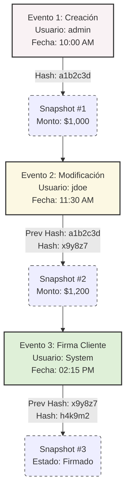

# Wireframes Conceptuales (Componentes Pesados)

Estos esquemas definen la estructura espacial de los componentes más complejos del sistema.

## 1. Tabla de Datos Enterprise (Data Grid)

**Propósito:** Visualizar miles de registros, aplicar filtros granulares y ejecutar acciones masivas.

```ascii
+-----------------------------------------------------------------------------------------+
| [ ] Todos | 15 Seleccionados  [ Aprobar ] [ Exportar ] [ Asignar ] [ ... ]              | <- Bulk Actions Bar
+-----------------------------------------------------------------------------------------+
| [Búsqueda por ID, Nombre...] | [Filtro: Estado (Vigente) v] [Filtro: Fecha v] [+ Añadir]| <- Toolbar / Filters
+-----------------------------------------------------------------------------------------+
| [x] | ID    ^ | Cliente      | Espacio      | Estado      | Monto      | Acciones     | <- Column Headers (Sortable)
|-----------------------------------------------------------------------------------------|
| [x] | #1024   | Acme Corp    | Ofic. 302    | [ VIGENTE ] | $ 1,500.00 | [Editar] [⋮] |
| [x] | #1025   | Globex       | Ofic. 401    | [ VIGENTE ] | $ 2,100.00 | [Editar] [⋮] |
| [ ] | #1026   | Initech      | Flex 12      | [ VENCIDO ] | $   800.00 | [Editar] [⋮] |
| [ ] | #1027   | Soylent      | Bodega B     | [ VIGENTE ] | $ 4,000.00 | [Editar] [⋮] |
+-----------------------------------------------------------------------------------------+
| Mostrando 1-50 de 12,400 registros                  [|<] [<] 1 2 3 ... 248 [>] [>|]     | <- Pagination
+-----------------------------------------------------------------------------------------+
```

## 2. Formulario de Creación (Multi-step Wizard)

**Propósito:** Crear una Cotización o Contrato sin perder contexto, autoguardado de progreso.

```ascii
+-----------------------------------------------------------------------------------------+
| Cotización: #Draft-001  (Guardado hace 1 min)                          [Cancelar] [X]   | <- Sticky Header
+-----------------------------------------------------------------------------------------+
|                                                                                         |
|  [ 1. Cliente ] -- [ 2. Espacios ] -- [ 3. Servicios ] -- [ 4. Resumen ]                | <- Stepper Progress
|                                                                                         |
|  +--------------------------------------------+   +---------------------------------+   |
|  |  Selección de Cliente                      |   | Resumen Contextual (Sticky)     |   |
|  |                                            |   |                                 |   |
|  |  RFC / RUC *                               |   | Cliente: Acme Corp              |   |
|  |  [ XAXX010101000               ] (Valid)   |   | Subtotal: $ 0.00                |   |
|  |                                            |   | Impuestos: $ 0.00               |   |
|  |  Razón Social *                            |   |---------------------------------|   |
|  |  [ Acme Corporation S.A. de C.V. ]         |   | Total Estimado: $ 0.00          |   |
|  |                                            |   |                                 |   |
|  |  Contacto Principal *                      |   +---------------------------------+   |
|  |  [ John Doe                    ]           |                                         |
|  +--------------------------------------------+                                         |
|                                                                                         |
+-----------------------------------------------------------------------------------------+
|                                                      [ Atrás ]   [ Siguiente Paso > ]   | <- Action Footer
+-----------------------------------------------------------------------------------------+
```

## 3. Vista de Auditoría Visual (Hash Chains & Snapshots)

**Propósito:** Rastrear manipulaciones en registros críticos (ej. Cotizaciones aprobadas, firmas).



*Descripción detallada del visor lateral de Snapshot:* Cuando se hace clic en un Nodo de Evento, el panel derecho muestra el `diff` JSON de exactamente qué campos cambiaron, con resaltado de sintaxis (Rojo para eliminación, Verde para adición).
